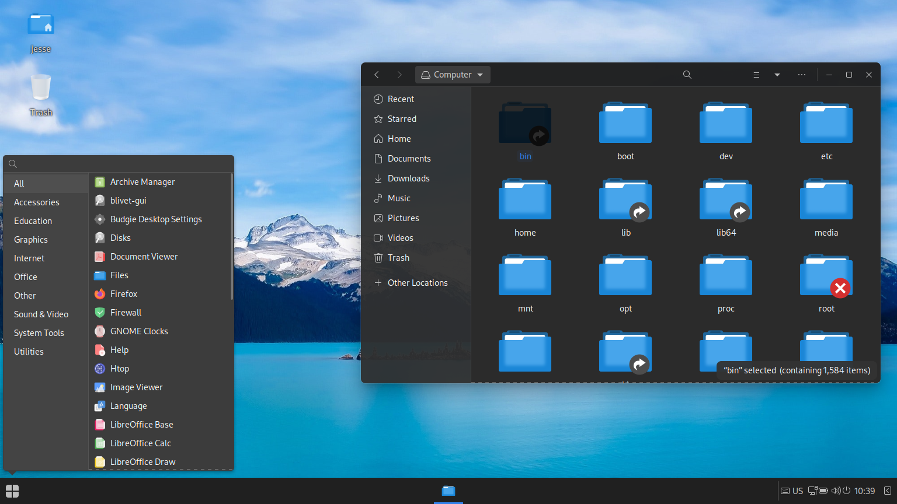
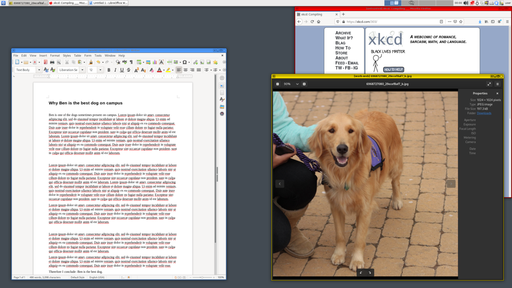
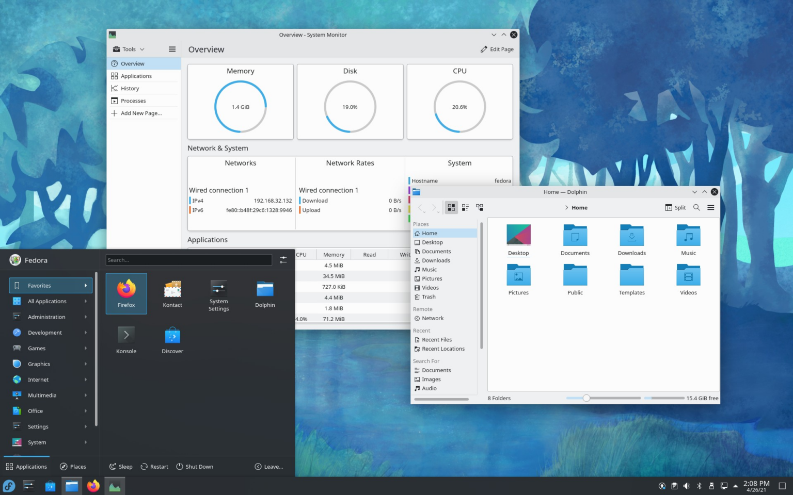

A few weeks ago, I made a YouTube video on risiOS, and a lot of people were surprised that it was Fedora-based because most distros are based on either Debian, Ubuntu, or Arch. Well, there are quite a few other distributions based on Fedora, so let’s go through some of them, specifically the ones mentioned on Fedora’s list of Fedora remixes wiki page.

https://youtu.be/stIndl1YuIg

## Nobara

[Nobara](https://nobaraproject.org/?ref=techhut.tv) is a distribution that is designed specifically for gaming. [It is made by a Red Hat Engineer who is also the](https://github.com/GloriousEggroll?ref=techhut.tv) Proton[\-GE contributor's maintainer and a Lutris developer](https://github.com/GloriousEggroll?ref=techhut.tv). Booting into it, I noticed that its flagship version has a customized version of GNOME, although there is also a vanilla one. Some of the extensions the non-Vanilla version installs include ArcMenu, Blur my Shell, and Dash to Panel. This gives it an overall setup similar to Windows 7. It also comes preinstalled with many gaming-related tools, including Steam, Lutris, Wine, ProtonUp, and GOverley.

Nobara also comes with countless patches to different things in the system to make the computer faster, including 11 patches to the kernel just listed on the website, as well as patches to glibc to fix broken apps, a version of mesa built from git to provide newer AMD/Intel drivers, some patches to GNOME such as variable refresh rate and GNOME Extension auto-updating, automatic driver installation on NVIDIA, RPMFusion & Flathub and many more features. So, if you are into gaming or need to push your hardware to the max, Nobara will

be a very good option for all of its patches. These aren’t just things you can set up on a Fedora installation because of the extra patches to things like the kernel and glibc.

## Ultramarine

<figure>

<figcaption>

Image Source: DistroWatch

</figcaption>

</figure>

Next up is [Ultramarine Linux](https://ultramarine-linux.org/?ref=techhut.tv). This is super heavy in development right now, [and there are a lot of planned features that haven’t been finished yet so far](https://wiki.ultramarine-linux.org/?ref=techhut.tv#planned-features). According to their website, [it is meant to be a spiritual successor to Korora Linux](https://wiki.ultramarine-linux.org/?ref=techhut.tv#general-philosophy). This distribution ships 3 different desktops, including GNOME, Budgie, and Pantheon, and they have a variant called Lapis, which is built around OSTree, similar to Fedora Silverblue. [It also tries to streamline the developer experience with tools like umpkg for packaging.](https://wiki.ultramarine-linux.org/development/umpkg?ref=techhut.tv) 

Booting into the flagship Budgie edition, I first noticed how beautiful the distro is, thanks to the Fluent GTK and icon themes. It comes preinstalled with Budgie stuff like the Budgie Control Center, Budgie Desktop Settings, and some extra utilities to extend Budgie, such as Window Shuffler, WallStreet, and QuickChar. On top of that, Ultramarine preinstalls things like RPMFusion, Flathub, and its dedicated repo containing the Budgie desktop, among other things. Overall, it’s a great distro if you want something with things like RPMFusion preinstalled and don’t want to set up that stuff yourself, and it’s also your only option if you want a good Pantheon or Budgie experience on a Fedora-based system. 

## Qubes OS

[Qubes](https://qubes-os.org/?ref=techhut.tv), is a very interesting distro. This is a distro built specifically for maximum security and privacy and [is even loved by people like Edward Snowden](https://twitter.com/Snowden/status/781493632293605376?ref=techhut.tv) and [the founder of Ethereum](https://twitter.com/vitalikbuterin/status/1086465679904038912?ref=techhut.tv). This is based on an older version of Fedora; in fact, it’s based on Fedora 32, which means out of the box, you cannot install packages on the main system due to Fedora 32’s repository being down by now unless you set up mirrors for older versions of Fedora yourself. However, you aren’t supposed to install stuff into the main system; this is a Virtual Machine based environment where everything you run is through a VM of a different operating system. 

When you boot up, you get a very light Xfce environment, and the only preinstalled applications on the system are terminals, Xfce settings, and Qubes tools. You also have several preinstalled Virtual machines, including a personal one, where you would likely want to install most of your software, disposable ones, and different OSes for each VM, including Fedora 36, Debian 11, and Whonix for TOR stuff. They also have disposable VMs that automatically wipe themselves when you are done with them. This is a very interesting distribution, so if you are interested, I recommend researching this yourself because this is a very complicated distribution.

## Montana Linux and FX64

<figure>

<figcaption>

FX64 Linux (Looks the same as Fedora Cinnamon and Montana Linux Fedora Cinnamon)

</figcaption>

</figure>

Now we have the main ones out of the way. Let’s mention a few other ones. Let’s start with [Montana Linux](https://img.cs.montana.edu/linux/montanalinux/?ref=techhut.tv). This distro has versions based on Fedora, Alma Linux, and older versions of CentOS. I booted into the Cinnamon version of it, and it just looks like Fedora Cinnamon. In fact, reading over the kickstart files which is what Fedora based distros use to build, the only changes I can find is that RPMFusion is preinstalled, a couple of extra media applications are installed. That’s it, there aren’t even special wallpapers, and Fedora branding is still there. So, you are probably better off just using normal Fedora, installing RPMFusion, or running another one of these distros. 

A similar distro is [FX64](http://fx64.net/?ref=techhut.tv), another Fedora-based distro with the Cinnamon desktop. But like Montana Linux, it still uses Fedora branding and wallpapers. FX64’s website literally just says, “FX64 Linux is a Fedora 36-based distro. Google Chrome, Java IcedTea, Skype & RAR are preinstalled.” Just install these yourself on Fedora… 

## Berry Linux

<figure>

<figcaption>

Image Source: DistroWatch

</figcaption>

</figure>

Berry Linux is a distro from Japan that is made to be run off a USB or CD. Although it is theoretically installable on an internal drive, I couldn’t get the installer to function properly. It has a very minimal LXDE desktop by default and only a few lightweight essentials preinstalled by default. This does have the potential to be great, but there are a lot of issues involving essential things that are just not working properly. For example, installing a package with dnf requires you to specify the Fedora release version, which breaks package management, and as I mentioned, its installer didn’t work for me. However, it is impressive because of its limited resource usage, and it even has its own display manager, BerryDM.

## Network Security Toolkit

<figure>

<figcaption>

Image Source: DistroWatch

</figcaption>

</figure>

[Network Security Toolkit](https://www.networksecuritytoolkit.org/nst/index.html?ref=techhut.tv) is a distro that can be used as both a server and a graphical system. When used as a graphical system, it uses the MATE desktop environment. It comes with a boatload of preinstalled network and security tools, including tools like Wireshark and “Angry IP Scanner”. It also has a built-in web interface that you can use to manage the system, including things like running a virus scan. Several functions in the web interface are broken out of the box, but that could also be because I didn’t set this up properly; I just opened the web interface and started playing around.

## Kedora

<figure>

<figcaption>

Image Source: [Kedora SourceForge page](https://sourceforge.net/projects/xange/?ref=techhut.tv)

</figcaption>

</figure>

Finally, our last distro is [Kedora](https://sourceforge.net/projects/xange/?ref=techhut.tv). A “Secure, Fast and Simple Distro, made for IT Sstudents”. It uses Plasma out of the box, but the only difference in the user interface is that it uses Windows 11 icons and the Windows 11 background by default. I noticed when installing something that, for some reason, preinstalls repos for both TeamViewer and Brave Browsers despite both not being installed by default. It also comes with Google Chrome as the default browser, as well as gdfuse for native Google Drive integration. Like most of the other distros, it also comes with RPMFusion, but this distro hasn’t been updated to a Fedora 36 base yet and is still based on Fedora 35. So, I’d pass on this one, considering it mimics Windows, preinstalls Chrome, and random repos, and this is another one where you could install Fedora with RPMFusion instead. 

## Official Fedora Spins

<figure>

<figcaption>

Fedora Plasma (Source: [Fedora Spins Website](https://spins.fedoraproject.org/kde/?ref=techhut.tv))

</figcaption>

</figure>

Speaking of Fedora Plasma, if you are looking for a good Fedora-based distro that isn’t just stocking Fedora, check out the [official Fedora spins](https://spins.fedoraproject.org/?ref=techhut.tv). These are stock Fedora, but they come with a different desktop of choice. There are separate spins for Plasma, XFCE, LXQt, MATE, Cinnamon, LXDE, Sugar, and I3. Also, if you want a more specialized Fedora-based distro, [check out Fedora Labs](https://labs.fedoraproject.org/?ref=techhut.tv). These provide special versions of Fedora with different sets of preinstalled applications depending on the use case. These include Astronomy, Comp Neuro, Design Suite, Games, Jam, Python Classroom, and Security Lab. Robotics Suite and Scientific. So, if you are in one of those fields, check out those Fedora Lab Spins or another Fedora Spin for a more preferred DE if you aren’t a GNOME fan. 

Another official spin worth mentioning is [Fedora Silverblue](https://silverblue.fedoraproject.org/?ref=techhut.tv). This is a version of Fedora-based around OSTree, which means you have an image-based read-only file system. This is similar to how operating systems like iOS and Chrome OS work. The image-based system allows people to do things like try development images and then revert back to a stable image, roll back broken updates, and remove many of the “it works on my system” type bugs that may occur on a normal Linux system. Apps are also fully installed through Flatpaks and containers, which allows the file system to be read-only. This is a really interesting distro, and this full overview doesn’t do it full justice, so we recommend doing more research about it if you are interested.

https://youtu.be/NRKE9W-6DHs
