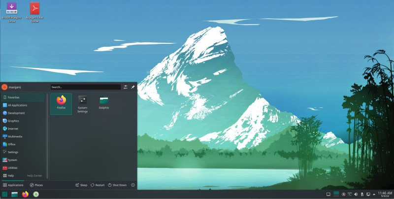
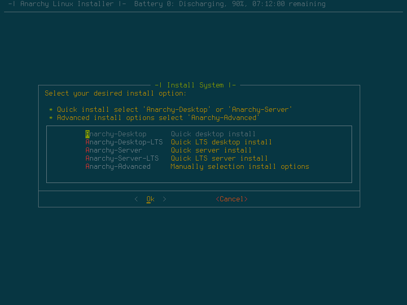

Many people love Manjaro as a clean and easy way to get into Arch or even Linux in general. But many people claim that Manjaro has diverted too far away from Arch to consider it. So, let’s compare both Arch and Manjaro, how they are different, and why more people might need to distinguish that Manjaro isn’t Arch. 

https://youtu.be/VzAw8a3Jx-k

## **So first, what is Arch?**  

Arch Linux is an independent rolling release distribution that is known for being very customizable and bleeding edge but not for being easy to install. Your hand isn’t held at all when you install Arch. You are forced to either learn how to [install your system manually from scratch](https://wiki.archlinux.org/title/Installation_guide?ref=techhut.tv), including partitioning through a terminal, installing the actual Linux kernel, and setting up your bootloader and DEs. Basically, the customization isn’t an option. It’s a requirement because you’re building it. 

[A TUI installer is being worked on](https://wiki.archlinux.org/title/Archinstall?ref=techhut.tv), but it’s not finished as of today and is still in the experimental stages, and Arch still doesn’t hold your hand during regular usage. Occasionally, there will be an update that requires manual intervention during the update to fix something. In fact, [most of the “Latest News” posts](https://archlinux.org/news/?ref=techhut.tv) on the Arch Linux homepage tell users they need to intervene to fix an update manually. 

<figure>

<figcaption>

Update Intervention Required on the Arch “Latest News” Page.

</figcaption>

</figure>

This makes Arch sound terrible, but it’s quite cool when you really get into Linux because you configure your system almost however you want. The only things it doesn’t let you do are that you must recompile things with different flags or things of that nature straight up. Arch is popular thanks to its [amazing wiki for documentation](https://wiki.archlinux.org/?ref=techhut.tv) and the [Arch User Repository](https://aur.archlinux.org/?ref=techhut.tv), which has many community-driven user-generated packages and installation scripts. 

## **What is Manjaro**?

<figure>

<figcaption>

Manjaro Plasma (Image Source: [Manjaro](https://manjaro.org/download/?ref=techhut.tv))

</figcaption>

</figure>

Manjaro is also a rolling release distribution based on top of Arch. It has many similarities to Arch, but Manjaro is closer to a more traditional distribution you would install and use, like Ubuntu or Fedora. It comes with its own set of packages, although some of the packages are slightly older because Manjaro holds back packages until they are fully tested. Manjaro does this with 3 repositories, Stable, Testing, and Unstable, each with progressively newer and less tested packages. Unstable would be the closest to Arch, but like Arch, you are alone if something happens. 

Manjaro should, in theory, be easier to run than Arch because it has a more stable package base and preinstalls tools such as Pamac for installing packages. You also don’t have the issue with Arch; whenever you need to do almost any task, you must know what package you need and install it. Manjaro preinstalls everything you’d need to do basic work out of the box, making it easier for Linux beginners. Keeping that in mind, however, I still wouldn’t call Manjaro a beginner distribution just because it is technically considered to be Arch-based.

## **Similarities** 

Given that Manjaro is Arch-based, there are still a few similarities. They both use Pacman for the default package manager, and they have relatively newer packages compared to distros, although Arch will always be more bleeding edge. They also both support things like the AUR. Bug fixes on Arch should also still work on Manjaro, and if you are reading the ArchWiki 8 times out of 10, the ArchWiki’s information should also work on Manjaro.

However, Arch and Manjaro are different distros. Asking a question about Manjaro on the Arch forums will get you laughed out because Manjaro is not just an installer for Arch. Calling Manjaro an Arch installer is like calling Ubuntu just Debian with a different installer. Manjaro and Arch are completely different things. There are loads of differences between Manjaro and Arch, just like how there are loads of differences between Ubuntu and Debian.

## **Key Differences**   

The main key difference is the packages. Since Manjaro uses its own repositories compared to Arch, this can and will lead to things breaking. For example, you must be careful when you use an AUR package on Manjaro because AUR packages are built for running on Arch, not Manjaro. So, if you are installing an AUR package and it depends on a newer package that is older on Manjaro, the package can break, or worse, your entire system could fail. 

Another difference between Manjaro is that it has its own package management system in addition to pacman called Pamac (and yes, the naming scheme is not helpful). Pamac includes a GUI frontend for package management and a CLI utility slightly easier to understand than pacman. For example, a system update is “pamac update’ instead of “pacman –Syu”. On top of that, Manjaro has a bunch of distribution-specific things. For example, it has a separate settings manager with several tools. This includes a tool that automatically installs hardware drivers and a Kernel tool that lets you switch between kernels with a graphical interface. There are also subtle differences in how Manjaro works compared to Arch, which can break things.

<figure>

<figcaption>

Manjaro Settings Manager ([source: Manjaro GitLab](https://wiki.manjaro.org/index.php/Manjaro_Settings_Manager?ref=techhut.tv))

</figcaption>

</figure>

## **Arch-like Alternatives** 

Even though Manjaro isn’t an Arch installer, there are certainly distros that are just Arch (or atleast similar enough to Arch) with an easy installer. If you’re looking for an Arch based system, I recommend installing these types of distros instead. Some of these distros would include [EndeavourOS](https://endeavouros.com/?ref=techhut.tv). EndeavourOS is very close to vanilla Arch and is essentially Arch with a much better installer and a convenient welcome app for configuring the system and setting it up.

https://youtu.be/Bz5INOLyql4

There are also distros like [Anarchy Linux](https://www.anarchy-linux.org/?ref=techhut.tv). You can also use a script like the preinstalled CLI “archinstall” script or another like [AUI](https://github.com/helmuthdu/aui?ref=techhut.tv) and [Archfi](https://github.com/MatMoul/archfi?ref=techhut.tv). So, these are the better options if you are looking for a distro like Arch with an Installer.

<figure>

<figcaption>

Anarchy Linux Installer (Image Source: [DistroWatch](https://distrowatch.com/gallery.php?distribution=anarchy&ref=techhut.tv))

</figcaption>

</figure>

Of course, Manjaro does have its places and use cases, but Manjaro seems to be commonly mismarketed as a way for beginners to get into Arch Linux. But Manjaro is not Arch (nor should it be considered a beginner distro, but that’s another topic).
